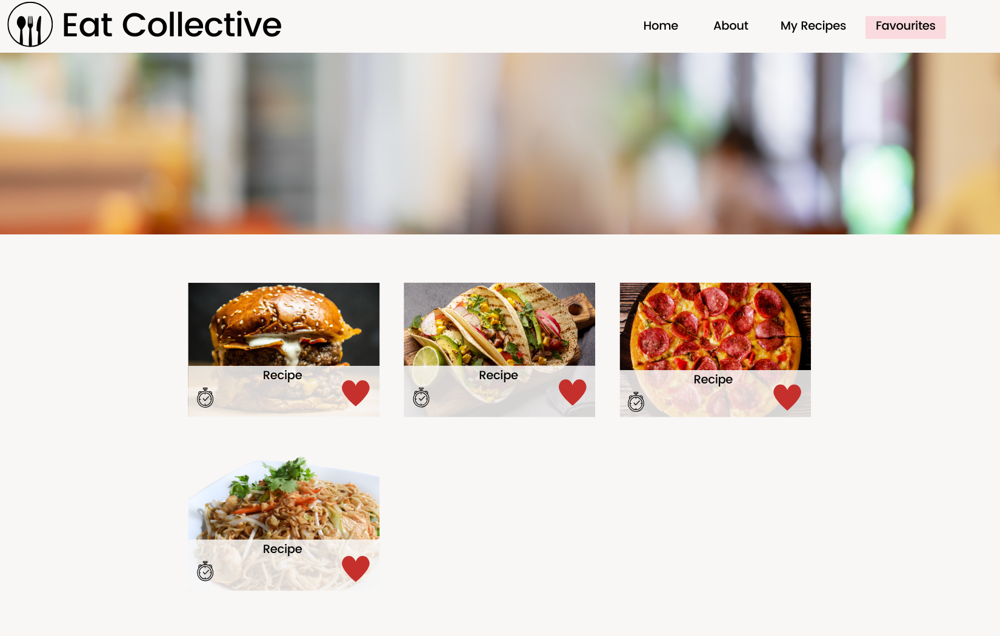
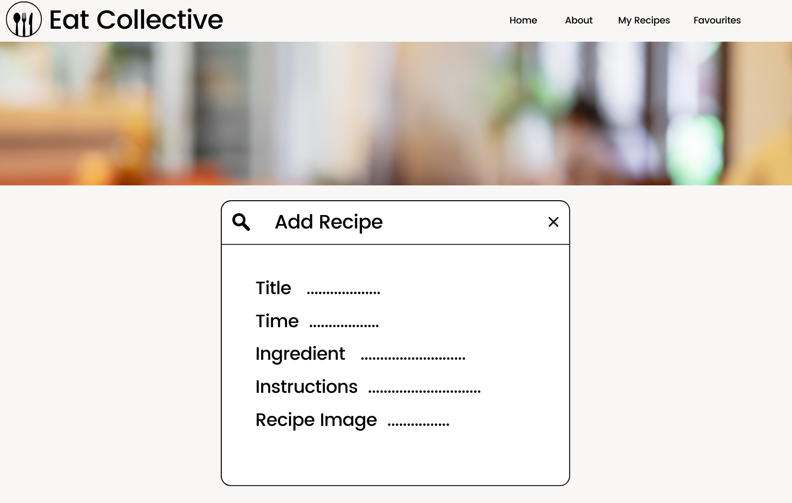
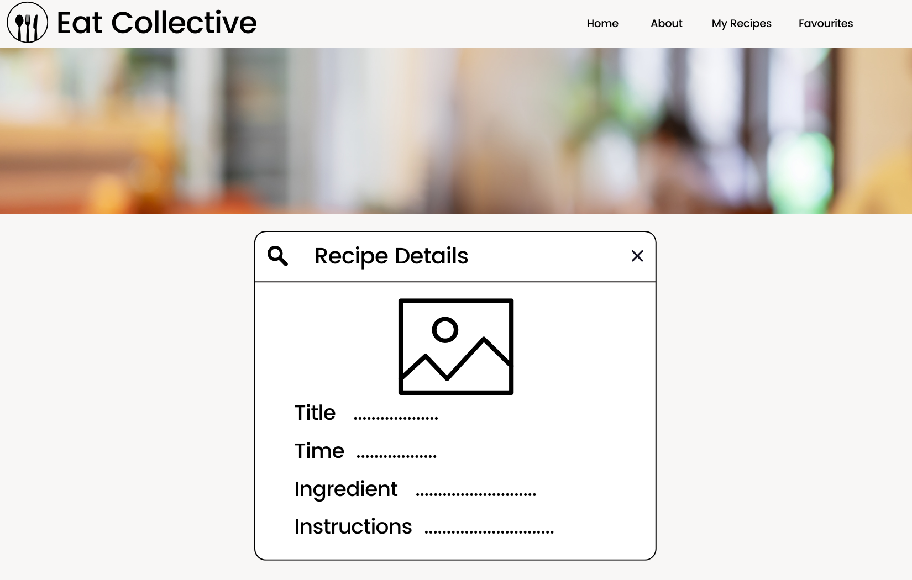

# 🍽️ Eat Collective

---

## 🧐 Overview

Eat Collective is a food blog web application that allows users to browse, add, edit, and manage their favourite recipes. Users can interact with a recipe database to explore diverse dishes and share their culinary creations.

### 🚩 Problem

Food enthusiasts often struggle to keep track of their favourite recipes or share their creations with others. Eat Collective offers a platform for managing and discovering recipes with ease!

### 🙋🏼‍♀️ User Profile

- Primary Users:
  - Home cooks looking to organize their recipes
  - Food enthusiasts who enjoy sharing recipes with others
  - Individuals searching for meal inspiration

### ⚙️ Features

- As a user, I want to be able to browse all recipes stored in the database
- As a user, I want to be able to click on a recipe to view detailed instructions and ingredients
- As a user, I want to be able to create and add my own recipes to the database
- As a user, I want to be able to update details of an existing recipe
- As a user, I want to be able to delete a recipe from a database
- As a user, I want to be able to mark a recipe as a favourite

#### 🔮 Optional Future Enhancements (or if time permits)

- Recipe Categories: As a user, I want to browse recipes by different categories to easily find the type of meal I'm looking for
- Recipe Sharing: As a user, I want to share my recipes with others so they can view and try them out
- User Accounts: As a user, I want to create an account to save my favourite recipes and keep track of my recipe submissions
- Social Features: As a user, I want to follow other users and connect with people who share similar cooking interests
- Notifications: As a user, I want to receive notifications when someone I follow shares a new recipe or interacts with my content
- Adding music that relates to the type of dish or mood


## 🛠️ Implementation

### 📚 Tech Stack

Frontend:

- React
- Sass
- Client Libraries:
  - React Router
  - Axios
- Backend:
  - Express
  - Server Libraries:
    - Knex
- Database:
  - MySQL

### 🌐 APIs

- No external APIs will be used for the time being

### 🗺️ Sitemap

- Home Page (/): displays all recipes
- My Recipes Page (/myRecipe): show recipes added by the user
- Favourite Recipes Page (/favRecipe): display recipes marked as favourites
- Add Recipe Page (/addRecipe): form to add a new recipe
- Edit Recipe Page (/editRecipe/:id): form to edit an existing recipe
- Delete Recipe Page (/deleteRecipe/:id): form to delete an existing recipe
- Recipe Details Page (/recipe/:id): displays detailed information about a recipe

### 📱 Mockups

#### Home Page


#### Favourite Page



#### Add Recipe Page



#### Recipe Detail



**Note:** This mockup is in beta - still a work in progress and subject to change.

### 📈 Data

**Recipe**
Represents each recipe stored in the database.

- id (primary key): unique identifier for each recipe
- title: the name of the recipe (e.g., "Pancakes")
- ingredients: a list of ingredients (stored as a JSON array)
  - ie.: ["flour", "milk", "eggs"]
- instructions: step-by-step cooking instructions (text)
  - ie.: "Mix ingredients, cook in a pan."
- time: the cooking or preparation time for the recipe
  - ie.: "20 mins"
- image: path to the image file associated with the recipe (optional)
  - ie.: "pancake.file"
- favourites: a boolean value indicating if the recipe is marked as a favourite (true or false)
  - ie.: true or false

### 🏁 Endpoints

#### Proxy Server Endpoints

HTTP Method Endpoint Description
GET /recipes _Fetch all recipes_
GET /recipes/:id _Fetch a single recipe by ID_
POST /recipes _Add a new recipe_
PUT /recipes/:id _Edit an existing recipe_
DELETE /recipes/:id _Delete a recipe by ID_

**GET /recipes** : Fetch all recipes.

**Response (Status 200 OK)**

```
   {
    "id": 1,
    "title": "Pancakes",
    "ingredients": ["flour", "milk", "eggs"],
    "instructions": "Mix ingredients, cook in a pan.",
    "time": "20 mins",
    "image": "pancake.file",
    "favourites": true
  },
  {
    "id": 2,
    "title": "Spaghetti Bolognese",
    "ingredients": ["spaghetti", "minced meat", "tomato sauce"],
    "instructions": "Boil spaghetti, cook meat, mix with sauce.",
    "time": "40 mins",
    "image": "spaghetti.file",
    "favourites": false
  }
    ...
```

**Response (Status 500 Internal Server Error)**

```
{
  "message": "Unable to fetch recipes due to server error."
}
```

**GET /recipes/:id** : Fetch a single recipe by its ID.

**Response (Status 200 OK)**

```
{
  "id": 1,
  "title": "Pancakes",
  "ingredients": ["flour", "milk", "eggs"],
  "instructions": "Mix ingredients, cook in a pan.",
  "time": "20 mins",
  "image": "pancake.file",
  "favourites": true
}

```

**Response (Status 404 Not Found)**

```
{
  "message": "Recipe with ID 1 not found."
}
```

**POST /recipes** : Add a new recipe.

**Request Body**

```
{
  "title": "Chicken Curry",
  "ingredients": ["chicken", "curry powder", "coconut milk"],
  "instructions": "Cook chicken, add curry powder, stir in coconut milk.",
  "time": "50 mins",
  "image": "chicken-curry.file",
  "favourites": false
}
```

**Response (Status 201 Created)**

```
{
  "id": 3,
  "title": "Chicken Curry",
  "ingredients": ["chicken", "curry powder", "coconut milk"],
  "instructions": "Cook chicken, add curry powder, stir in coconut milk.",
  "time": "50 mins",
  "image": "chicken-curry.file",
  "favourites": false
}
```

**Response (Status 400 Bad Request)**

```
{
  "message": "Invalid data provided. Title and ingredients are required."
}
```

**PUT /recipes/:id** : Edit an existing recipe.

**Request Body**

```
{
  "title": "Vegan Pancakes",
  "ingredients": ["flour", "almond milk", "bananas"],
  "instructions": "Mix ingredients, cook in a pan.",
  "time": "25 mins",
  "image": "vegan-pancakes.file",
  "favourites": true
}
```

**Response (Status 200 OK)**

```
{
  "id": 1,
  "title": "Vegan Pancakes",
  "ingredients": ["flour", "almond milk", "bananas"],
  "instructions": "Mix ingredients, cook in a pan.",
  "time": "25 mins",
  "image": "vegan-pancakes.file",
  "favourites": true
}
```

**Response (Status 404 Not Found)**

```
{
  "message": "Recipe with ID 1 not found."
}
```

**Response (Status 400 Bad Request)**

```
{
  "message": "Invalid update data. Title and ingredients are required."
}
```

**DELETE /recipes/:id** : Delete a recipe by its ID.

**Response (Status 204 No Content)**

```
No response body for status 204.
```

**Response (Status 404 Not Found)**

```
{
  "message": "Recipe with ID 1 not found."
}
```

**Response (Status 500 Internal Server Error)**

```
{
  "message": "Unable to delete the recipe due to server error."
}
```


## 🏞 Roadmap

**Planning & Setup**

- Define key features (browsing, creating, editing, deleting recipes)
- Set up project structure and tools (React, Express, MySQL, Knex, etc.)
- Create wireframes for main pages (Home, Recipe Details, Add/Edit Recipe)

**Frontend Setup**

- Build components/basic layouts for Home, Recipe Details, My Recipes, and Add/Edit forms
- Set up navigation with react-router for easy page transitions

**Backend API & Database**

- Design MySQL schema for recipes (title, ingredients, instructions, favourites)
- Implement/test CRUD operations (GET, POST, PUT, DELETE) for recipes
- Add basic error handling for invalid requests

**Recipe Details**

- Display recipe details (title, ingredients, instructions, image)
- Allow easy navigation to the recipe list or user dashboard

**Recipe Browsing**

- Enable search by title or ingredients
- Allow users to mark recipes as favourites
- Display recipes in a clean, responsive grid/list view
- Show user’s saved recipes

**Styling & Responsiveness**

- Design for website-first (ensuring the app works across all devices is optional)
- Use Sass

**Testing & Debugging**

- Test API functionality (correct data handling)
- Check UI for smooth navigation and interactions

**Additional Features (Optional)**

- Add user authentication for personalized recipe management
- Implement recipe categories
- Allow recipe sharing on social media or via sharing a link

**Deployment & Final Testing (Optional)**

- Deploy on platforms like Heroku or Netlify
- Conduct final tests to ensure everything works in a live environment
- Prepare documentation and demo for stakeholders


## ⏳ Future Implementations

- User authentication / login
- Filters for recipe categories
- Recipe sharing
- Adding music depending on mood or dish
- Notifications of new recipes uploaded
