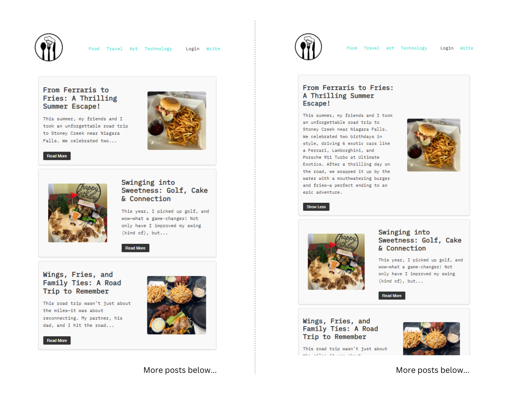
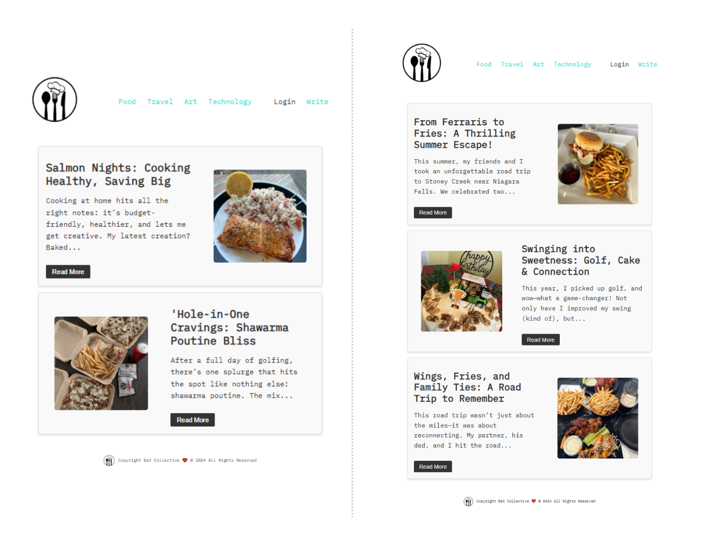
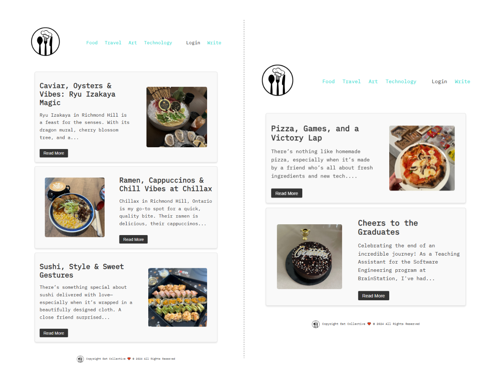
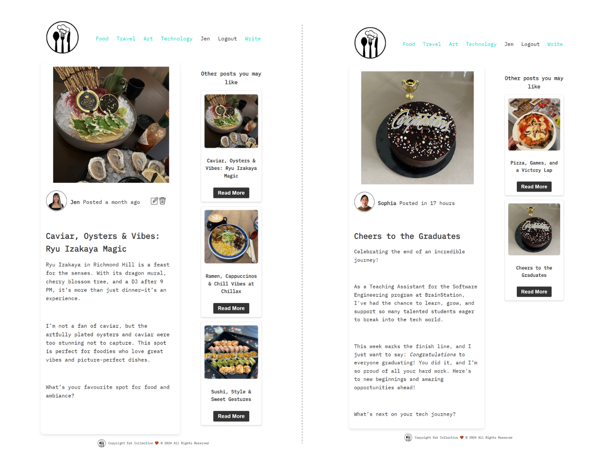
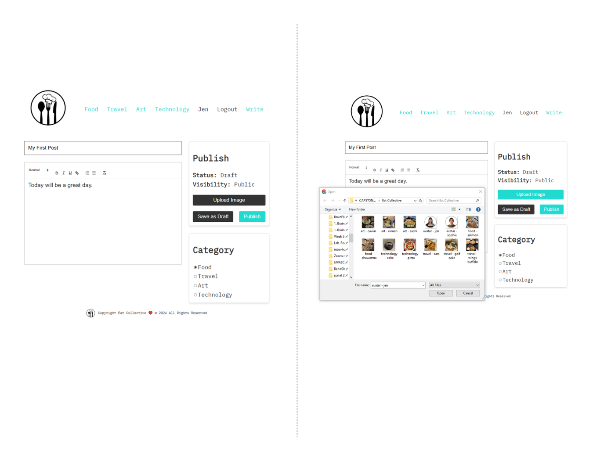
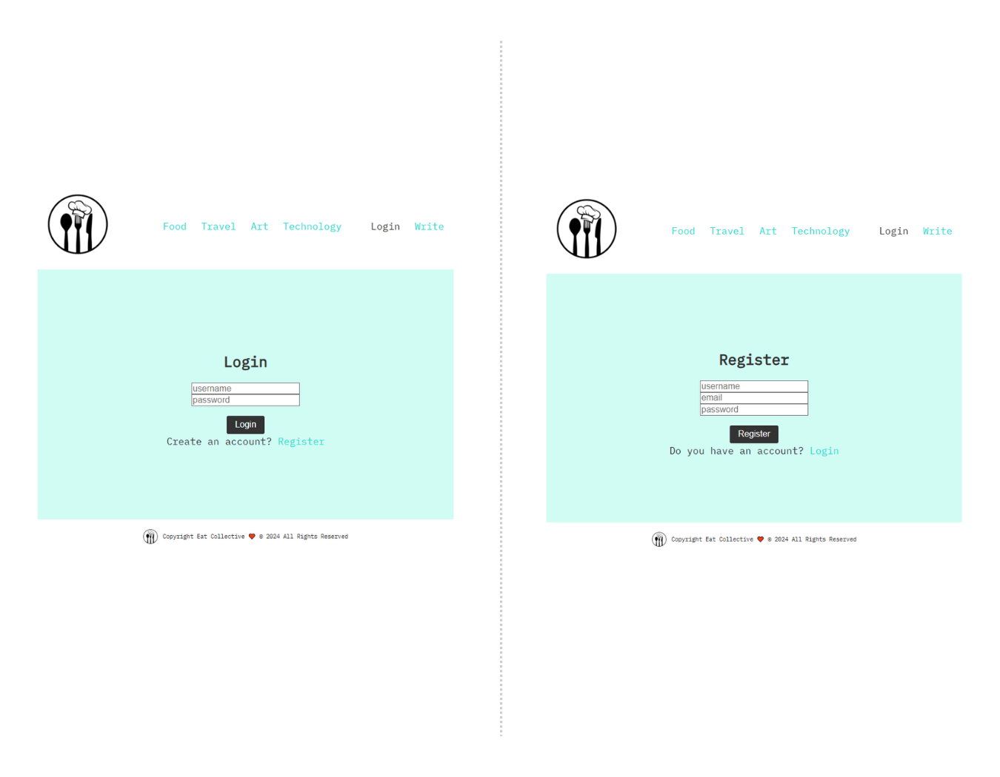

# 🍽️ Eat Collective

_Eat Collective is a versatile, food-centered blog where users can register/login to share stories and upload images, while exploring diverse categories such as travel, art, and technology._

_This project consists of two repositories: a **Client (Frontend)** built with React and a **Server (Backend)** built with Node.js, Express, and Knex for database management. Follow the steps below to set up and run the application._

**😎 Fun Fact**: All posts/users/pictures are authentic

## ⚙️ Set Up

**1. Clone the Repositories**
Clone both the client and server repositories using the following commands:

- **Client (Frontend)**:

  ```
  git clone https://github.com/jennifern6/eat-collective-client.git
  ```

- **Server (Backend)**:
  ```bash
  git clone https://github.com/jennifern6/eat-collective-server.git
  ```

**Step 2: Navigate to Each Directory**
After cloning, navigate to each directory:

- **Client (Frontend)**:

  ```
  cd eat-collective-client
  ```

- **Server (Backend)**:
  ```bash
  cd eat-collective-server
  ```

**Step 3: Install Dependencies**
Install the required dependencies for both repositories:

- **Client (Frontend)**:

  ```
  npm install
  ```

- **Server (Backend)**:
  ```bash
  npm install
  ```

**Step 4: Set Up the Backend (Server)**
The backend uses Knex for database management. Follow these steps to set up the database:

- **Run the migrations to set up the database schema:**

  ```
  npx knex migrate:latest
  ```

- **Populate the database with seed data:**
  ```bash
  npx knex seed:run
  ```

**Step 5: Start the Development Servers**
Start the development servers for both repositories:

- **Client (Frontend)**:

  ```
  npm run dev
  ```

- **Server (Backend)**:
  ```bash
  npm run dev
  ```
  **Step 6: Access the Application**
  Start the development servers for both repositories:
- Open the **Frontend** by visiting http://localhost:5173 in your browser
- Ensure the **Backend** server is running on its configured port, http://localhost:8800

**Additional Notes**

- Ensure you have **Node.js** and npm installed on your system
- Confirm your database (e.g., PostgreSQL, MySQL) is set up and running
- Update the .env file in the Server folder with the necessary environment variables (e.g., database credentials)
- **Username and Password (created)**:
  ```
  User 1: Username: Jen Password: jen
  User 2: Username: Sophia Password: sophia
  ```

## 👀✨ Frontend Visuals

#### Home Page (snapshot)

_Right image is when you click on "Read More" button_


#### Categories Page: Food & Travel

_Left image: Food category
Right image: Travel category_


#### Categories Page (continued): Art & Technology

_Left image: Art category
Right image: Technology category_


#### Specific posts: Logged in as user "Jen"

_Left image: Can edit or delete Jen's post
Right image: Cannot edit or delete Sophia's post_


#### Categories: Write a post & Upload an image

_Left image: Write/Create a post
Right image: Upload an image_


#### Categories: Login & Register

_Left image: Login page
Right image: Register page_


**🥰 Have a great day!**
